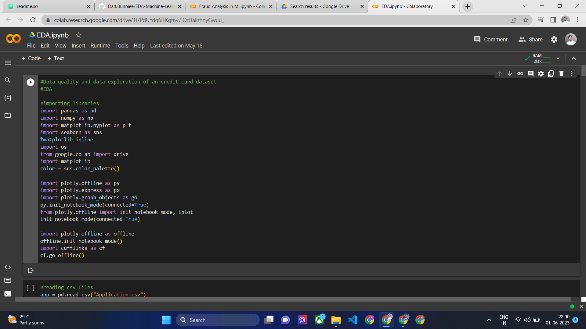

 

# Data Quality and Data Exploration of Credit Card Dataset in Google Collab
This repository contains the code and information related to data quality assessment and data exploration of a credit card dataset using machine learning techniques in Google Colab.

## Dataset
The credit card dataset used in this project contains various features related to credit card transactions. It includes attributes such as transaction amount, transaction type, merchant information, time of transaction, and whether the transaction is fraudulent or not.

## Objective
The main objective of this project is to perform a thorough data quality assessment and explore the credit card dataset to gain insights and prepare the data for subsequent machine learning tasks.

## Setup
To run the code of this repository in google collab, follow these steps:
- Download the codescript and dataset
- Import dataset in google collab
- Paste the codescript in google collab
- Run the task and execute the task one by one

## Google Collab
URL : https://colab.research.google.com/drive/1i7PdUYdq6iLKgfny7jQrHakrhnyGwuu_?usp=sharing

## Screenshots

## Installation

- Launch Google Colab and upload the Jupyter notebook (EDA.ipynb) provided in this repository.

- Open the Jupyter notebook and execute the code cells sequentially to perform data quality assessment and data exploration.

## Contents
The repository contains the following files:

- EDA.ipynb: google collab notebook containing the code for data quality assessment and data exploration.
- Data Capstone EDA zipped: The credit card dataset all CSV files in CSV format.

## Usage
The google collab notebook (EDA.ipynb) provides a step-by-step guide on how to perform data quality assessment and explore the credit card dataset using various machine learning techniques. It includes code snippets and explanations for each step.

## Results
Upon executing the code in the google collab notebook, you will obtain the following outcomes:

Data quality assessment results, including missing values analysis, data type validation, and handling of outliers or inconsistencies.
Descriptive statistics and visualizations to gain insights into the credit card dataset.
Correlation analysis to identify relationships between different features.
Feature engineering techniques, if required, to create new informative features.
Preprocessing steps such as data normalization, encoding categorical variables, and splitting the dataset into training and testing sets.

## Conclusion
Performing a comprehensive data quality assessment and exploring the credit card dataset using machine learning techniques is essential for understanding the data and preparing it for subsequent analysis or predictive modeling. By following the steps outlined in the provided collab notebook, you will gain valuable insights into the dataset and ensure its suitability for further machine learning tasks.

Please refer to readme for detailed code implementation and analysis.

## Developer 
Himanshu Hada
himanshuhada380@gmail.com

## License

[MIT](https://choosealicense.com/licenses/mit/)
